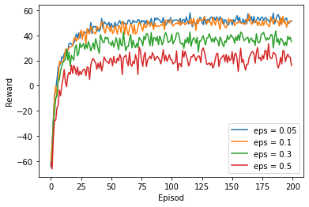
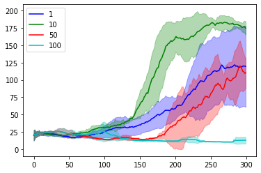

# Reinforcement Learning Assingements
Assignment 1:
For the final results and interpretations refer to "A1/A1_FinalResults.ipynb".

  1. Part 1: programming value iteration, policy iteration and modified policy iteration for Markov decision processes in Python
  
  2. Part 2: programming Q-learning algorithm in Python and test it with the maze problem described in "TestRLmaze.py"
  
    -
  
  3. Part 3: train a deep Q-network to solve the CartPole problem from Open AI Gym
  
    -
